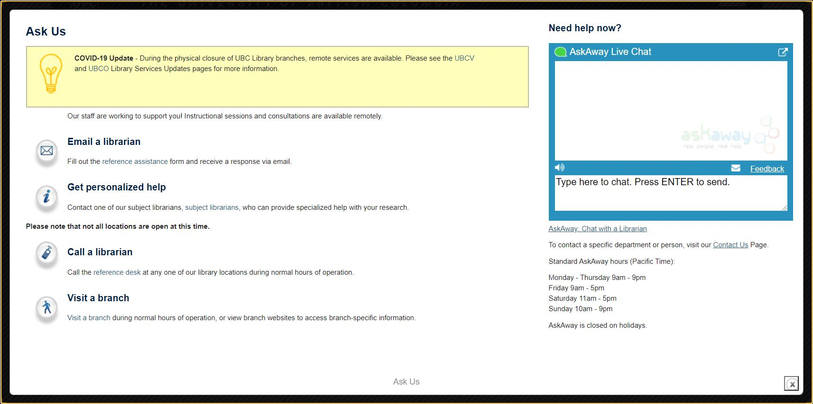

# Video

<video controls="controls" name="GRAD student orientation to the library - part 3" width="100%" src="GRAD_student_orientation_to_the_library_part_3_burned_in_captions_.mp4"></video>

## Links

Finding your subject librarian: [https://directory.library.ubc.ca/subjectlibrarians/](https://directory.library.ubc.ca/subjectlibrarians/)

*Subject or liaison librarians are librarians that work closely with a Department, Faculty and Programs. They are more familiar with specific subjects and support students' learning and research, teach classes, provide tips on using subject specific databases and design Research Guides.*

Research Guides: [https://guides.library.ubc.ca/](https://guides.library.ubc.ca/)

*Carefully tailored for different research areas, Research Guides present a selection of databases, research tips, websites, the main resources related to a subject.*

## UBC Vancouver Library - Zoom drop-in sessions

David Lam Library: [https://lam.library.ubc.ca/research-help-2/](https://lam.library.ubc.ca/research-help-2/)

Koerner Library, Humanities and Social Sciences (HSS) Division: [https://koerner.library.ubc.ca/research-help-2/](https://koerner.library.ubc.ca/research-help-2/)

Woodward Library: [https://woodward.library.ubc.ca/research-help/](https://woodward.library.ubc.ca/research-help/)

## AskAway

*This virtual live chat is supported by librarians at Academic Institutions all across British Columbia and Yukon.*

